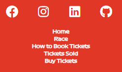
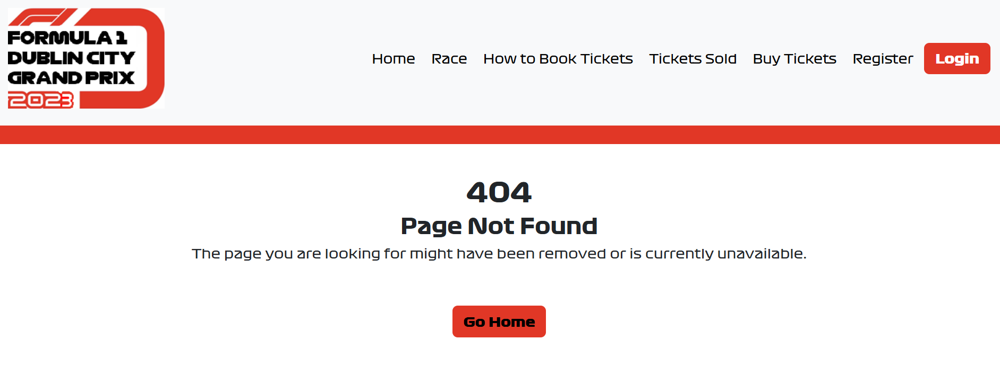

# Manual Tests

## Epic 1: Core Website Functionality
### Related User Stories
[1](https://github.com/Grawnya/f1-dublin-race-ticket-booking-system/issues/1) - As a user, I can navigate through the website easily so that I can get more information about the race, the track itself and ticket booking.
[2](https://github.com/Grawnya/f1-dublin-race-ticket-booking-system/issues/2) - As a user, I can get information regarding the race details so that I can spend less time having to search for the suitable information.
[3](https://github.com/Grawnya/f1-dublin-race-ticket-booking-system/issues/3) - As a user, I can obtain ticket booking information so that I can easily book tickets.

These 3 User Stories’ criteria are met on the [Home Page](https://github.com/Grawnya/f1-dublin-race-ticket-booking-system#landing-page). The home page consists of various sections to ensure that the user is informed at all times:

* [Race Details Section](#race-details-section "Race Details Section") which meets the criteria of [2](https://github.com/Grawnya/f1-dublin-race-ticket-booking-system/issues/2), as it can be easily reached on the home page directly by scrolling down or by clicking on the link on the information carousel.
* [How to Book Tickets Section](#how-to-book-tickets-section "How to Book Tickets Section") which meets the criteria of [3](https://github.com/Grawnya/f1-dublin-race-ticket-booking-system/issues/3), as it can be easily reached on the home page directly by scrolling down the page.

The website is generally well laid out and uses a striking colour scheme to easily read all its content. It also utilises links to the various pages on the site via a navbar, footer and buttons to provide a logical flow that is easy to understand, meeting the criteria of [1](https://github.com/Grawnya/f1-dublin-race-ticket-booking-system/issues/1).

> 
\
&nbsp;

Manual testing here also included: 
* Verifying that the items in this section stacked on top of each other for smaller screens so the information was still easy to obtain. 
* Ensuring that the track mapped onto Google Maps would appear if the user clicked on the track schematic with the stands and then could revert back to the track schematic with the stand when clicked again.
* Making sure that all buttons located under the “How to Book” cards and the carousel sliders were working as they were programmed to.

[4](https://github.com/Grawnya/f1-dublin-race-ticket-booking-system/issues/4) - As a user, I can find the race's social media accounts so that I can keep up-to-date with race details.

The criteria for [4](https://github.com/Grawnya/f1-dublin-race-ticket-booking-system/issues/4) was met by placing social media links in the footer, where the user can select the icons for the various social media sites to connect to the race organisers. These symbols are the universal method to reach the race’s social media accounts from their own website. 

> 
\
&nbsp;

[5](https://github.com/Grawnya/f1-dublin-race-ticket-booking-system/issues/5) - As a user, I can see who else is attending the race so that I know what fans are in attendance.

The criteria of [5](https://github.com/Grawnya/f1-dublin-race-ticket-booking-system/issues/5) was met by creating a “Tickets Sold” page which could have been reached by the navbar or the Information Carousel. Each user who opts to share their ticket, has it posted on this page which allows general users to see who is attending. 

On the “Tickets Sold” page, it was important to verify that the pagination worked i.e. if more than 6 tickets were booked overall, a new page was created and the users could go back and forth of on the pages to see all the tickets. Manual testing also included making sure that the tickets were responsive and that they stacked on top of each other on smaller screens.

>  
\
&nbsp;

[15](https://github.com/Grawnya/f1-dublin-race-ticket-booking-system/issues/15) - As a user, I can easily use the navbar to navigate the website so that I can find all relevant content.

The criteria for [15](https://github.com/Grawnya/f1-dublin-race-ticket-booking-system/issues/15) was met by placing a navbar at the top of the website. It contains all important links and ensures navigation is easy. This was manually tested by going through each link. On smaller screens, the navbar collapses into a hamburger button.

> 
\
&nbsp;

[19](https://github.com/Grawnya/f1-dublin-race-ticket-booking-system/issues/19) - As a user, I can easily reach the home page in case I get an error so that I am not stuck on an error page and have to select the back button.

The criteria for [19](https://github.com/Grawnya/f1-dublin-race-ticket-booking-system/issues/19) was met by creating 404 and 500 error pages that would provide the user with some information as to what went wrong. These were manually tested by checking all the button links were successful when causing the errors to occur. The navbar located at the top of the error pages also allows for easy navigation back to the homepage.

> 
\
&nbsp;
[Back to Top](#table-of-contents)
\
&nbsp;
