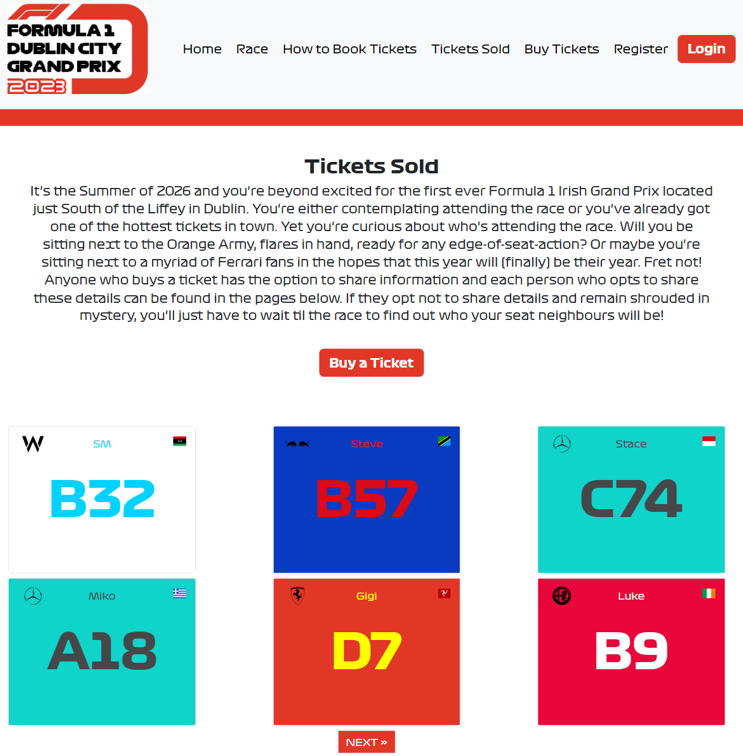
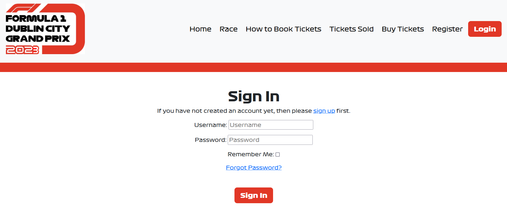
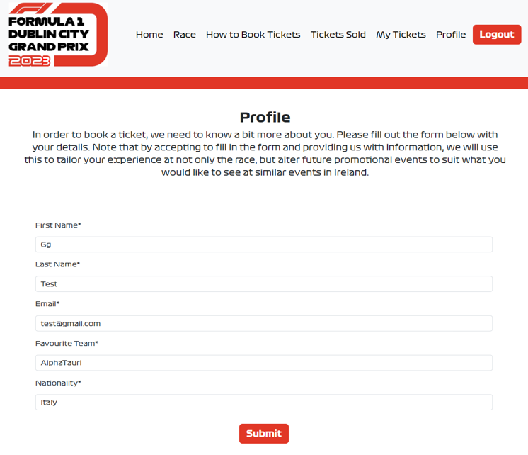
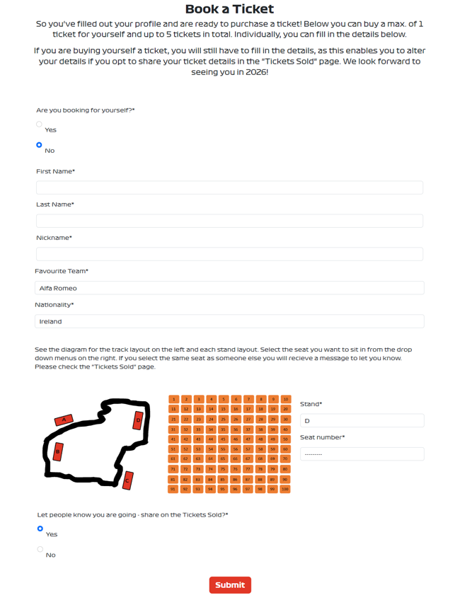
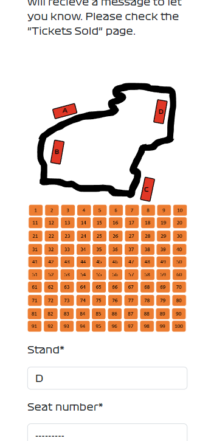

# Manual Tests

## Epic 1: Core Website Functionality
### Related User Stories
 [1](https://github.com/Grawnya/f1-dublin-race-ticket-booking-system/issues/1) - As a user, I can navigate through the website easily so that I can get more information about the race, the track itself and ticket booking.
\
&nbsp;
[2](https://github.com/Grawnya/f1-dublin-race-ticket-booking-system/issues/2) - As a user, I can get information regarding the race details so that I can spend less time having to search for the suitable information.
\
&nbsp;
[3](https://github.com/Grawnya/f1-dublin-race-ticket-booking-system/issues/3) - As a user, I can obtain ticket booking information so that I can easily book tickets.

These 3 User Stories’ criteria are met on the [Home Page](https://github.com/Grawnya/f1-dublin-race-ticket-booking-system#landing-page). The home page consists of various sections to ensure that the user is informed at all times:

* [Race Details Section](#race-details-section "Race Details Section") which meets the criteria of [2](https://github.com/Grawnya/f1-dublin-race-ticket-booking-system/issues/2), as it can be easily reached on the home page directly by scrolling down or by clicking on the link on the information carousel.
* [How to Book Tickets Section](#how-to-book-tickets-section "How to Book Tickets Section") which meets the criteria of [3](https://github.com/Grawnya/f1-dublin-race-ticket-booking-system/issues/3), as it can be easily reached on the home page directly by scrolling down the page.

The website is generally well laid out and uses a striking colour scheme to easily read all its content. It also utilises links to the various pages on the site via a navbar, footer and buttons to provide a logical flow that is easy to understand, meeting the criteria of [1](https://github.com/Grawnya/f1-dublin-race-ticket-booking-system/issues/1).

> 
\
&nbsp;

Manual testing here also included: 
* Verifying that the items in this section stacked on top of each other for smaller screens so the information was still easy to obtain. 
* Ensuring that the track mapped onto Google Maps would appear if the user clicked on the track schematic with the stands and then could revert back to the track schematic with the stand when clicked again.
* Making sure that all buttons located under the “How to Book” cards and the carousel sliders were working as they were programmed to.

[4](https://github.com/Grawnya/f1-dublin-race-ticket-booking-system/issues/4) - As a user, I can find the race's social media accounts so that I can keep up-to-date with race details.

The criteria for [4](https://github.com/Grawnya/f1-dublin-race-ticket-booking-system/issues/4) was met by placing social media links in the footer, where the user can select the icons for the various social media sites to connect to the race organisers. These symbols are the universal method to reach the race’s social media accounts from their own website. 

> 
\
&nbsp;

[5](https://github.com/Grawnya/f1-dublin-race-ticket-booking-system/issues/5) - As a user, I can see who else is attending the race so that I know what fans are in attendance.

The criteria of [5](https://github.com/Grawnya/f1-dublin-race-ticket-booking-system/issues/5) was met by creating a “Tickets Sold” page which could have been reached by the navbar or the Information Carousel. Each user who opts to share their ticket, has it posted on this page which allows general users to see who is attending. 

On the “Tickets Sold” page, it was important to verify that the pagination worked i.e. if more than 6 tickets were booked overall, a new page was created and the users could go back and forth of on the pages to see all the tickets. Manual testing also included making sure that the tickets were responsive and that they stacked on top of each other on smaller screens.

>  
\
&nbsp;

[15](https://github.com/Grawnya/f1-dublin-race-ticket-booking-system/issues/15) - As a user, I can easily use the navbar to navigate the website so that I can find all relevant content.

The criteria for [15](https://github.com/Grawnya/f1-dublin-race-ticket-booking-system/issues/15) was met by placing a navbar at the top of the website. It contains all important links and ensures navigation is easy. This was manually tested by going through each link. On smaller screens, the navbar collapses into a hamburger button.

> 
\
&nbsp;

[19](https://github.com/Grawnya/f1-dublin-race-ticket-booking-system/issues/19) - As a user, I can easily reach the home page in case I get an error so that I am not stuck on an error page and have to select the back button.

The criteria for [19](https://github.com/Grawnya/f1-dublin-race-ticket-booking-system/issues/19) was met by creating 404 and 500 error pages that would provide the user with some information as to what went wrong. These were manually tested by checking all the button links were successful when causing the errors to occur. The navbar located at the top of the error pages also allows for easy navigation back to the homepage.

> 
\
&nbsp;
\
&nbsp;

## Epic 2: User Authentication
### Related User Stories
[7](https://github.com/Grawnya/f1-dublin-race-ticket-booking-system/issues/7) - As a user, I can register or log in so that I can manage my tickets.

The criteria for [7](https://github.com/Grawnya/f1-dublin-race-ticket-booking-system/issues/7) is met by using the `allauth` templates from Django and editing them to match the layout of the rest of the webpage. The user can easily register or login by selecting the suitable option in the navbar. If the user has successfully logged in/is authenticated, then an option called “My Tickets” can be found on the navbar which allows the users to manage their tickets. All links and buttons have been tested to ensure that they successfully go to the correct webpages.

> 
\
&nbsp;

[9](https://github.com/Grawnya/f1-dublin-race-ticket-booking-system/issues/9) - As a user, I can see if I am logged in so that I can easily log out or log in.

Similar to [7](https://github.com/Grawnya/f1-dublin-race-ticket-booking-system/issues/7), the criteria for [9](https://github.com/Grawnya/f1-dublin-race-ticket-booking-system/issues/9) is met when the user has logged in, which is confirmed by a message at the top of the screen to say they have logged in. The navbar is then altered to include a logout button. The login and logout button are on the top right hand side corner of the page in large screens and is bigger than the rest of the navbar items to attract the user. The buttons also change to a yellow background with black text when the user hovers over them to attract them to click on the button.

> 

**When Logged In:**
> 

**When Logged Out:**
> 
\
&nbsp;

[18](https://github.com/Grawnya/f1-dublin-race-ticket-booking-system/issues/18) - As a user, I can edit my user details when logged in so that I can ensure that my details are up-to-date.

To meet the criteria for [18](https://github.com/Grawnya/f1-dublin-race-ticket-booking-system/issues/18), when the user has logged in, a “Profile” navbar item appears next to the “logout” button. If the user has never created a profile, a blank document appears, but if they have previously filled it in and only want to update the details. The form values will be populated with the last saved values from the user. This has been manually tested to ensure that the user has to create a profile before buying a ticket to prevent non-users from buying tickets.

> 
\
&nbsp;
\
&nbsp;

## Epic 3: Admin Functionality
### Related User Stories
[20](https://github.com/Grawnya/f1-dublin-race-ticket-booking-system/issues/20) - As a site owner/admin, I can log in so that I can access the website's backend.

It is imperative to also think about the website from the admin/site owner’s point of view. Django enables the user to easily add admins and allows them to view data from the models that has been imported from forms. 

The criteria for [20](https://github.com/Grawnya/f1-dublin-race-ticket-booking-system/issues/20) is met, by adding `/admin` to the homepage link, which redirects the user to the admin page. If the user has not logged in on the website, they are prompted to login here.

> 

Manually testing has verified that if a non-admin user tries to follow the `/admin` link, they will automatically be logged out and prompted to but in valid credentials.

Alternatively, if the user has already logged in and have valid admin credentials, they are automatically redirected to the admin dashboard, which shows all models created, sites, social media accounts etc. along with any recent actions, allowing the user to access the website’s backend.

> 
\
&nbsp;

[21](https://github.com/Grawnya/f1-dublin-race-ticket-booking-system/issues/21) - As a site owner/admin, I can delete tickets booked by users so that I can alter the race's attendance and stand capacity.

The criteria for [21](https://github.com/Grawnya/f1-dublin-race-ticket-booking-system/issues/21) was met by clicking into the “Tickets” database on the dashboard, which redirects the user to the specific database with every entry. If the admin wants to delete a Ticket, they can select it and in the “action” dropdown menu above the table, they can select “Delete selected tickets”.

> 

This redirects the admin to a prompt to ask them if they are sure they want to delete the ticket.

> 

If the admin confirms that they want to delete it, they are redirected to the “Tickets” database, where they receive a message to confirm the deletion and the ticket can no longer be seen.

> 

If the user wants to select more tickets, they can manually go through and ticket the box next to each row, or alternatively they can filter by who booked the ticket, when it was booked, favourite team and nationality on the right hand side.

> 
\
&nbsp;
\
&nbsp;

## Epic 4: Ticket Booking Functionality
### Related User Stories
[6](https://github.com/Grawnya/f1-dublin-race-ticket-booking-system/issues/6) - As a user, I can book a ticket so that I can attend the race.
\
&nbsp;

[16](https://github.com/Grawnya/f1-dublin-race-ticket-booking-system/issues/16) - As a user, I can edit and/or delete tickets I have booked when logged in so that I can make any necessary changes.

The primary function of the webpage is to allow users to book tickets and to edit their bookings based on requirements i.e. to edit or delete their tickets.

Manual testing ensures that the user needs to have logged-in and created a profile in order to book a ticket. It mentions this several times throughout the website, but if the user opts to still book a ticket, they will be either prompted to login or create a profile in messages.

Once the user has successfully logged in and created a profile, they can click on the “My Tickets” item in the navbar which sends them to the “My Tickets” page. At the top of the page, the user can find a button, which lets them “Buy a Ticket”. 

This meets the requirements for [6](https://github.com/Grawnya/f1-dublin-race-ticket-booking-system/issues/6), as the user is redirected to an empty form, where they can fill in details to book a ticket. This form also appears on smaller screens.

> 

The criterion for successful booking is:
1. Only to have booked a maximum of one ticket for themselves.
2. To book a maximum of 5 tickets in total. 
3. To ensure that no field is blank.
4. To select an empty seat – can check the “Tickets Sold” page to see what is filled.
5. The user has to be logged in and has to have created a profile. 

Respective Manually Tested Errors that occur if the criterion is not met:
1. Message pops up to say that the user has booked more than one ticket for themselves and if they want to buy more they have to either edit or delete the extra ticket.
2. Message pops up to say that the user has booked more than 5 tickets and if they want to buy more they have to delete some of their tickets.
3. An little message will pop up next to the input field that the user has left blank and they’ll be prompted to put in a valid value.
4. If the user selects a seat that someone else has already booked, a message pops up to say that it is occupied and to select a new seat.
5. Message pops up to say that the user is either not logged in and/or doesn’t have a profile and therefore, needs to do these before they can book a ticket.

> 

This creates a ticket at the bottom of the “My Tickets” screen with the users info and both “Edit” and “Delete” buttons beneath each ticket to alter the ticket. This meets the criteria for [16](https://github.com/Grawnya/f1-dublin-race-ticket-booking-system/issues/16) as the user can edit the existing ticket by selecting the “Edit” button and it directs the user to a form that looks similar to the “New Ticket” page but is prepopulated with the ticket information. The ticket information can be updated by changing the value sin the form fields and submitting it by selecting the “Submit” button at the bottom of the page. Any revisions can be seen in the ticket.

The user can also delete a ticket by selecting the “Delete” button, which redirects the user to a similar form to the “Edit Ticket” page, but it includes a button at the top prompting the user to “Go Back” to “My Tickets” in case they clicked the button by mistake. If they want to confirm that they want to delete the button, they have to scroll down to the bottom of the page to click “Delete”.
\
&nbsp;

[8](https://github.com/Grawnya/f1-dublin-race-ticket-booking-system/issues/8) - As a user, I can buy tickets for others so that I can bring more people to the race.

The criteria for [8](https://github.com/Grawnya/f1-dublin-race-ticket-booking-system/issues/8) is met by introducing the `for_self` field in the form. This enables the user to book a ticket for themselves and also up to 4 more extra tickets to ensure no ticket touts book out large stands and that family members can book tickets for their children etc.

As explained in the criterion above, if the limits are exceeded, suitable messages appear to explain what the issue is.
\
&nbsp;

[11](https://github.com/Grawnya/f1-dublin-race-ticket-booking-system/issues/11) - As a user, I can select my favourite team when booking tickets so that I can let users know who I support and see who other fans in attendance support.
[12](https://github.com/Grawnya/f1-dublin-race-ticket-booking-system/issues/12) - As a user, I can select my nationality when booking tickets so that I can let users know what country I am from and see where other fans in attendance are from.
[13](https://github.com/Grawnya/f1-dublin-race-ticket-booking-system/issues/13) - As a user, I can input a nickname so that I don't have to reveal my real name and can use it to identify people whom I am buying tickets for.

The criteria for [11](https://github.com/Grawnya/f1-dublin-race-ticket-booking-system/issues/11), [12](https://github.com/Grawnya/f1-dublin-race-ticket-booking-system/issues/12) and [13](https://github.com/Grawnya/f1-dublin-race-ticket-booking-system/issues/13) are met in the ticket booking forms as well, as the inputted values are connected to suitable CSS settings and SVGs that help format the tickets.

As seen in the ticket above.:
* A logo of their favourite team appears in the top left hand corner.
* A logo of their country’s flag appears in the top right hand corner.
* The Nickname appears in the top centre of the flag instead of the username, first name or last name details.

Note that these features remain even when the screen size changes, as verified with manual testing. These details also can’t be left blank.
\
&nbsp;

[14](https://github.com/Grawnya/f1-dublin-race-ticket-booking-system/issues/14) - As a user, I can select my seat when booking tickets from a graphic so that I can easily see what seats are free and where I can potentially sit.
The criteria of [14](https://github.com/Grawnya/f1-dublin-race-ticket-booking-system/issues/14) is met by providing an SVG of the track schematic layout with the 4 current stands. Next to it is a layout of the seats within a stand. In future sprints, this will be altered to be more interactive with live seat selection from the schematic, but currently based on the 2 images, the user has to select a seat and stand from a dropdown menu.

> 

In order to see what seats are free and where the user can potentially sit, the user is encouraged to visit the “Tickets Sold” page to see where users are sitting and select a seat which does not appear here.
\
&nbsp;