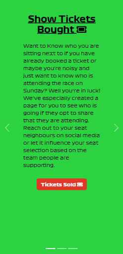
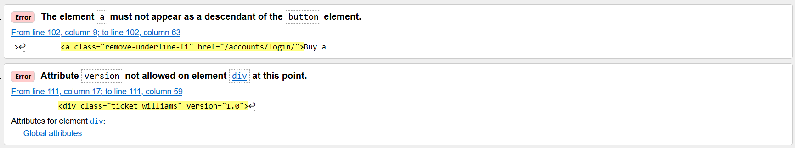
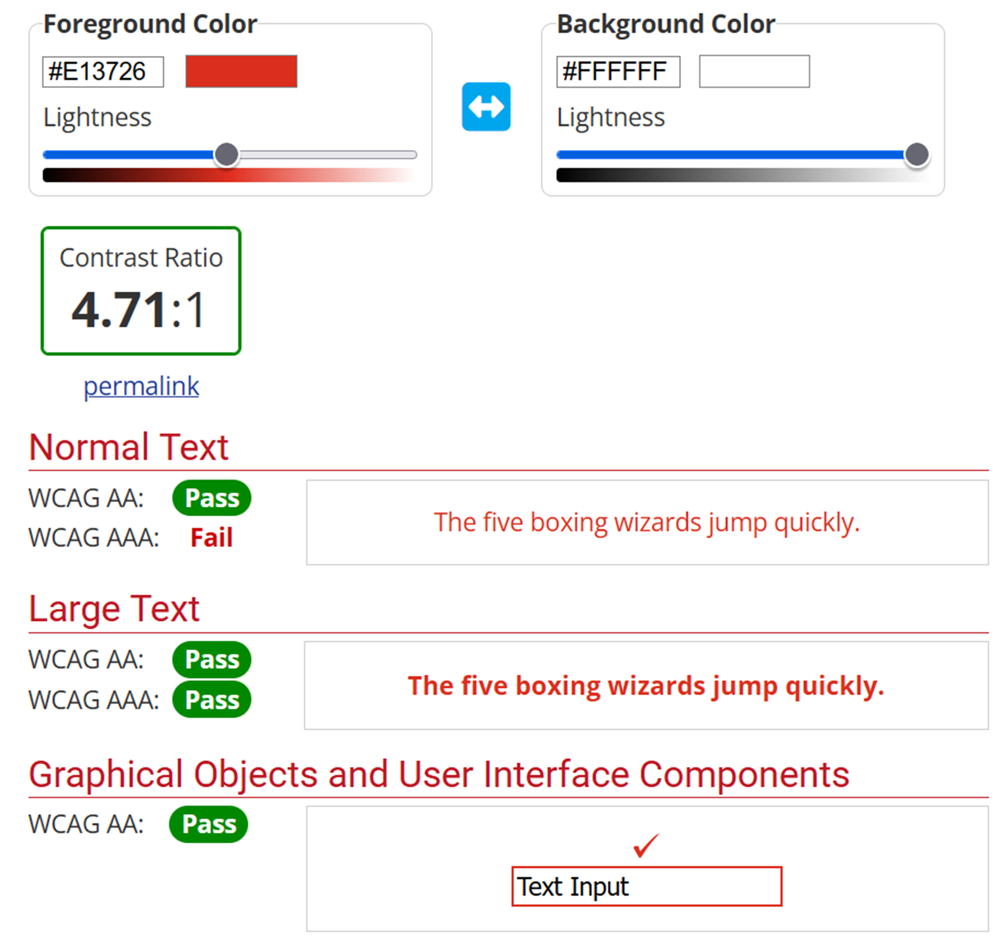
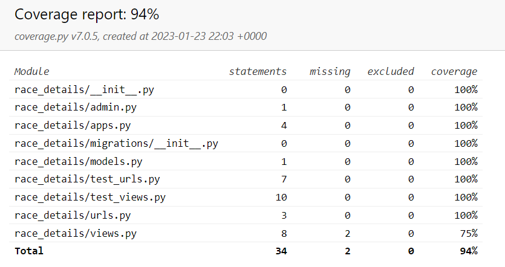

# F1 Dublin Race Ticket Booking System

## Introduction

Welcome to the coding repository dedicated to the F1 Dublin City Grand Prix website; A website which not only provides details about a made up street track located in Dublin City, Ireland, but also allows users to book tickets for the event.

The project is very relevant as Formula 1 is an increasingly popular sport, frequently looking to add new race locations and the flexibility of the website ensures that its design can be utilised for any event that requires booking a ticket in advance.

[Visit the Website Here](https://f1-dublin-race.herokuapp.com)

[Visit the Project's GitHub Repository Here](https://github.com/Grawnya/f1-dublin-race-ticket-booking-system)

# Table of Contents

* [UX](#ux "UX")
    * [Strategy](#strategy "Strategy")
    	* [Purpose](#purpose "Purpose")
   	    * [User Stories](#user-stories "User Stories")
   	        * [For This Sprint](#for-this-sprint "For This Sprint")
   	        * [For Future Sprints](#for-future-sprints "For Future Sprints")
    * [Scope](#scope "Scope")
    	* [Sprint 1](#sprint-1 "Sprint 1")
    	* [Sprint 2](#sprint-2 "Sprint 2")
    	* [Future Sprints](#future-sprints "Future Sprints")
    * [Structure](#structure "Structure")
    	* [Project Applications](#project-applications "Project Applications")
    	* [Databases](#databases "Databases")
			* [WebsiteUser](#websiteuser "WebsiteUser")
			* [Ticket](#ticket "Ticket")
    * [Surface](#surface "Surface")
    	* [Font](#font "Font")
    	* [Icons](#icons "Icons")
    	* [Colours](#colours "Colours")
    	* [Responsive Screens](#responsive-screens "Responsive Screens")
	* [Features](#features "Features")
		* [Existing Features](#existing-features "Existing Features")
			* [Landing Page](#landing-page "Landing Page")       
			* [Navigation Bar](#navigation-bar "Navigation Bar")       
			* [Information Carousel](#information-carousel "Information Carousel")       
			* [Race Details Section](#race-details-section "Race Details Section")       
			* [How to Book Tickets Section](#how-to-book-tickets-section "How to Book Tickets Section")       
			* [Footer](#footer "Footer")       
			* [Tickets Sold Page](#tickets-sold-page "Tickets Sold Page")       
			* [Profile](#profile "Profile")       
			* [My Tickets Page](#my-tickets-page "My Tickets Page")       
			* [New Ticket Page](#new-ticket-page "New Ticket Page")       
			* [Edit Ticket Page](#edit-ticket-page "Edit Ticket Page")       
			* [Delete Ticket Page](#delete-ticket-page "Delete Ticket Page")       
			* [Flag Animation](#flag-animation "Flag Animation")       
			* [Django Template Pages](#django-template-pages "Django Template Pages")       
			* [Messages](#messages "Messages")       
			* [Error Pages](#error-pages "Error Pages")       
		* [Technologies Used](#technologies-used "Technologies Used")       
			* [Languages](#languages "Languages")       
			* [Tools](#tools "Tools")       
			* [Styling](#styling "Styling")       
			* [Validation](#validation "Validation")       
			* [Databases](#databases "Databases")
	* [Testing](#testing "Testing")
		* [Code Validation](#code-validation "Code Validation")
			* [W3C HTML Validator](#w3c-html-validator "W3C HTML Validator")
				* [First Attempt of Home Page](#first-attempt-of-home-page "First Attempt of Home Page")
				* [Final Attempt of Home Page](#final-attempt-html-of-home-page "Final Attempt of Home Page")
				* [Only Attempt of the Django Templates](#only-attempt-of-the-django-templates "Only Attempt of the Django Templates")
				* [First Attempt of Ticket Sold Page](#first-attempt-of-tickets-sold-page "First Attempt of Ticket Sold Page")
				* [Final Attempt of Ticket Sold Page](#final-attempt-html-of-tickets-sold-page "Final Attempt of Ticket Sold Page")
			* [W3C CSS Validator](#w3c-css-validator "W3C CSS Validator")
				* [First Attempt of CSS Files](#first-attempt-of-css-files "First Attempt of CSS Files")
			* [JSHint](#jshint "JSHint")
				* [Final Attempt of JavaScript Files](#final-attempt-of-javascript-files "Final Attempt of JavaScript Files")
			* [Python Syntax Checker PEP8 Validation](#python-syntax-checker-pep8-validation "Python Syntax Checker PEP8 Validation")
				* [First Attempt of Python Files](#first-attempt-of-python-files "First Attempt of Python Files")
				* [Final Attempt of Python Files](#final-attempt-of-python-files "Final Attempt of Python Files")
		* [Lighthouse](#lighthouse "Lighthouse")
			* [Final Attempt for Lighthouse](#final-attempt-forlighthouse "Final Attempt for Lighthouse")
		* [Responsiveness](#responsiveness "Responsiveness")
		* [Web Aim Contrast Checker](#web-aim-contrast-checker "Web Aim Contrast Checker")
		* [Browser Compatibility](#browser-compatibility "Browser Compatibility")
		* [Manual Testing](#manual-testing "Manual Testing")
		* [Automated Testing](#automated-testing "Automated Testing")
     

\
&nbsp;

# UX
User Experience of UX focuses on how accessible the website is to the user and it’s ease of use, which is pivotal the website’s success.

Therefore, the UX aspect of the project can be broken down into 5 Planes:
* The Strategy Plane
* The Scope Plane
* The Structure Plane
* The Skeleton Plane
* The Surface Plane
\
&nbsp;

## Strategy
In order to ensure the project aligns with these planes, it is vital to keep the target audience at the forefront at all times.

The target audience consists of:
* 25 – 45 year olds.
* People that are avid sport and Formula 1 fans.
* People who like to share their experiences with their friends.

As a result, users will expect:
* A website with easy navigation and a logical progression to its flow.
* Plenty of information with regards to the F1 race and track details.
* The ability to book, edit and cancel tickets for the event.
\
&nbsp;

### Purpose
The purpose of this website is to promote a potential Formula 1 race in Dublin in the future and allow users to register their interest in the first wave of ticket releases.
\
&nbsp;

### User Stories
#### For This Sprint
| id  |  Content | Label |
| ------ | ------ | ------ |
| [1](https://github.com/Grawnya/f1-dublin-race-ticket-booking-system/issues/1) | As a user, I can navigate through the website easily so that I can get more information about the race, the track itself and ticket booking. | Must Have |
| [2](https://github.com/Grawnya/f1-dublin-race-ticket-booking-system/issues/2) | As a user, I can get information regarding the race details so that I can spend less time having to search for the suitable information. | Must Have |
| [3](https://github.com/Grawnya/f1-dublin-race-ticket-booking-system/issues/3) | As a user, I can obtain ticket booking information so that I can easily book tickets. | Must Have |
| [4](https://github.com/Grawnya/f1-dublin-race-ticket-booking-system/issues/4) | As a user, I can find the race's social media accounts so that I can keep up-to-date with race details. | Should Have |
| [5](https://github.com/Grawnya/f1-dublin-race-ticket-booking-system/issues/5) | As a user, I can see who else is attending the race so that I know what fans are in attendance. | Could Have |
| [6](https://github.com/Grawnya/f1-dublin-race-ticket-booking-system/issues/6) | As a user, I can book a ticket so that I can attend the race. | Must Have |
| [7](https://github.com/Grawnya/f1-dublin-race-ticket-booking-system/issues/7) | As a user, I can register or log in so that I can manage my tickets. | Must Have |
| [8](https://github.com/Grawnya/f1-dublin-race-ticket-booking-system/issues/8) | As a user, I can buy tickets for others so that I can bring more people to the race. | Should Have |
| [9](https://github.com/Grawnya/f1-dublin-race-ticket-booking-system/issues/9) | As a user, I can see if I am logged in so that I can easily log out or log in. | Must Have |
| [11](https://github.com/Grawnya/f1-dublin-race-ticket-booking-system/issues/11) | As a user, I can select my favourite team when booking tickets so that I can let users know who I support and see who other fans in attendance support. | Could Have |
| [12](https://github.com/Grawnya/f1-dublin-race-ticket-booking-system/issues/12) | As a user, I can select my nationality when booking tickets so that I can let users know what country I am from and see where other fans in attendance are from. | Could Have |
| [13](https://github.com/Grawnya/f1-dublin-race-ticket-booking-system/issues/13) | As a user, I can input a nickname so that I don't have to reveal my real name and can use it to identify people whom I am buying tickets for | Should Have |
| [14](https://github.com/Grawnya/f1-dublin-race-ticket-booking-system/issues/14) | As a user, I can select my seat when booking tickets from a graphic so that I can easily see what seats are free and where I can potentially sit. | Should Have |
| [15](https://github.com/Grawnya/f1-dublin-race-ticket-booking-system/issues/15) | As a user, I can easily use the navbar to navigate the website so that I can find all relevant content. | Must Have |
| [16](https://github.com/Grawnya/f1-dublin-race-ticket-booking-system/issues/16) | As a user, I can edit and/or delete tickets I have booked when logged in so that I can make any necessary changes. | Must Have |
| [18](https://github.com/Grawnya/f1-dublin-race-ticket-booking-system/issues/18) | As a user, I can edit my user details when logged in so that I can ensure that my details are up-to-date. | Must Have |
| [19](https://github.com/Grawnya/f1-dublin-race-ticket-booking-system/issues/19) | As a user, I can easily reach the home page in case I get an error so that I am not stuck on an error page and have to select the back button. | Could Have |
| [20](https://github.com/Grawnya/f1-dublin-race-ticket-booking-system/issues/20) | As a site owner/admin, I can log in so that I can access the website's backend. | Must Have |
| [21](https://github.com/Grawnya/f1-dublin-race-ticket-booking-system/issues/21) | As a site owner/admin, I can delete tickets booked by users so that I can alter the race's attendance and stand capacity. | Must Have |

\
&nbsp;
#### For Future Sprints
| id  |  Content | Label |
| ------ | ------ | ------ |
| [10](https://github.com/Grawnya/f1-dublin-race-ticket-booking-system/issues/10) | As a user, I can obtain email confirmation of my ticket bookings so that I know I have successfully booked the tickets. | Could Have |

\
&nbsp;
## Scope
In order to ensure that the current sprint (i.e. the elements required for the current project submission) are completed, the focus was as follows:
\
&nbsp;

### Sprint 1
This sprint focuses on the “Must Haves” and the marking criteria:
* A homepage with basic details on how to book tickets and obtain race details.
* Navbar enabling the user to reach the different pages within the site.
* The ability of the user to login and create a profile.
* An application that allows the user to book a ticket and then edit or delete the ticket based on their situation.
\
&nbsp;

### Sprint 2
This sprint builds on Sprint 1:
* Fills the homepage up with more details on how to book tickets and obtain race details, adding extra styling and animation of a more enjoyable experience.
* Creating a “Tickets Sold” page to allow the user to see who else is attending.
* Adding styling to card elements to create mock tickets with user’s details for their “My Tickets” page.
\
&nbsp;

### Future Sprints
Elements to add to the site in the future:
* Create an app that allows users to add tickets based on clicking on an animated SVG of a stand, similar to the cinema.
* Incorporate email confirmation.
* Allow user to put in banking details to confirm the booking.
\
&nbsp;

## Structure
Having a well-worked out project structure ensures that creating the project would occur in a more logical manner and the sprint steps can be closely followed. Therefore, the content was broken into applications to account for the various tasks and into database tables to organise how the data obtained from the user will be stored.
\
&nbsp;

### Project Applications
For this project, 3 applications were created:
* race_details – To provide details regarding booking the tickets and race information. A solely static project with no models.
* see_attendees – To create the extra “Tickets Sold” page which shows all users who opted to share their ticket info.
* booking – To book, edit and delete tickets, where the user needs to create a profile first, which is connected to the ticket booking details.
\
&nbsp;

### Databases
2 databases can be found in the “booking” application, which enable the user to create the profile required to book tickets and then to stored booked ticket information. The schematic below provides the relationship between both [the WebsiteUser Model](#websiteuser "The WebsiteUser Model") and [the Ticket Model](#ticket "The Ticket Model").

> 
\
&nbsp;

#### WebsiteUser
The WebsiteUser model is used to obtain more information from the user than just their username, email and password. It provides relevant information with regards to the person who made the booking of a ticket and can be used to influence decisions that the race organisers will do to enhance the race experience.

It can be broken down as follows:
* `username` - Unique username that user has chosen when registering.
* `first_name` - First name of user.
* `last_name` - Last name of user.
* `email` - User's email that they didn't use to login.
* `fave_team` - User's favourite current Formula 1 team.
* `nationality` - User's nationality that they identify as.
\
&nbsp;

#### Ticket
The Ticket model is used to store ticket information, regardless of if it being a new ticket, or if it is an existing ticket that is being edited or deleted. Information from the ticket booking can be shared if the person booking the ticket opts to share the details on the “Tickets Sold” page.

It can be broken down as follows:
* `for_self` - Boolean value if ticket is for the user or a non-user.
* `booked_by` - Connection to the current user's WebsiteUser object.
* `first_name`  - First name of user.
* `last_name` - Last name of user.
* `booked_on` - DateTime of when the form was booked for easier organisation.
* `nickname` - A nickname that the user may have for the shared ticket.
* `fave_team` - User's favourite current Formula 1 team.
* `nationality` - User's nationality that they identify as.
* `seat_number` - The seat number in which the user will sit.
* `stand` - The stand letter in which the user will be sitting in.
* `show` - Boolean value if the user wants to share their attendance in the “Tickets” Sold page.
\
&nbsp;

## Skeleton
The skeleton provides a broad initial idea that is further refined and built on. It enables the creation of a plan that aligns with the requirements of the [user stories](#user-stories "User Stories") and the [sprints](#scope "Sprints"). Therefore, wireframes can be created to act as a design aid and provide the website skeleton.
\
&nbsp;

### Wirefames
[Balsamiq](https://balsamiq.com/wireframes/ "Balsamiq") was used to create the conception for the website appearance and flow. I initially created a mobile version in-line with my mobile-first approach and then followed with a medium and large screen version. The key is to make sure that the website is responsive on various screens.

Basic wireframes can be found below (Note that these vary slightly from the final website design):

* [Home Page](documentation/home_page.png "Home Page")
* [Tickets Sold](documentation/tickets_sold.png "Tickets Sold") – The My Tickets Page is very similar, as it shows only the user’s tickets with edit and delete buttons beneath and has an extra button to redirect to the user’s profile.
* [Buy Tickets](documentation/buy_tickets.png "Buy Tickets") – The pages to edit and delete the tickets are very similar.
\
&nbsp;

## Surface
The surface plane refers more to the aesthetics and the interface itself. It’s important to select the right colour, font and icons for your website to ensure it is as appealing as possible.
\
&nbsp;

### Font
The fonts used were the official Formula 1 fonts. They were sourced from [here](https://www.reddit.com/r/formula1/comments/8rpzq3/f1_font/) and were used in suitable sections.

The Formula 1 fonts that were used are and they can be seen below:
* Formula1-Black
* Formula1-Bold
* Formula1-Regular
* Formula1-Wide

The font was loaded into the project used `.tff` files and following the steps found at [this link](https://www.geeksforgeeks.org/how-to-include-a-font-ttf-using-css/).
\
&nbsp;

### Icons
In order to obtain some icons for the website, [Font Awesome](https://fontawesome.com/ "Font Awesome") will be utilised. Icons were only utilised in the carousel to add a bit of character to the main page and for social media icons.

For the user’s nationality, their country’s flag will be displayed on the ticket. The [`flag-icons`](https://alexsobolenko.github.io/flag-icons/) CSS library was used to create these.
\
&nbsp;

### Colours
To select the colour palette for the project, I was inspired by the official Formula 1 colour scheme, which heaving relies on a distinct shade of an orange based red, black and white. When checking the contrast of the colours on [Web AIM](https://webaim.org/resources/contrastchecker/ "Web AIM"), the dark green with the white passed. For the light mode, the dark blue with the white also passed. Therefore the following colours were selected for the project:

Where:
*  #E13726 (also known as --f1-red) is used for the background of one of the carousel slides as well as the majority of the backgrounds of the buttons on the website.
*  #fff (also known as white) is used for the majority of the websites background and the font colour of many buttons.
*  #000 (also known as --black) is used for the background of one of the carousel slides and for the majority of the font.
*  #2cd341 (also known as --green) is used for the background of one of the carousel slides and occasionally is a background colour for a button if it is next to a button in --f1-red.
*  #ebff00 (also known as --yellow) is used for the background of one of the carousel slides and often for buttons in their hover state.

Each Formula 1 team also required a set of colours based on their 2022 colour scheme and can be seen in the diagram below. These colours were used to created the ticket styling,

\
&nbsp;

### Responsive Screens
The website will be built for a small mobile screen of width 320px and then will also meet the requirements for a medium/tablet, large and extra-large screen, as shown in the table below.

| Screen Size   | Breakpoint |
| -----------   | ---------- |
| small/mobile  |    320px   |
| medium/tablet |    768px   |
| large         |   992px    |
| extra-large   |   1400+px  |

\
&nbsp;
[Back to Top](#table-of-contents)
\
&nbsp;

# Features

## Existing Features
### Landing Page
The landing page is the first introduction to the website that the user generally has and therefore, it needs to be visibly attractive and easy to navigate. The large Formula 1 Dublin City Grand Prix logo at the top of the page tells the user clearly what the website is about. 

A labelled navigation bar with various headings provides the user with details regarding how to use the website effectively.

A carousel with bright slides attracts the user to its content, which prompts the user to create a profile, show the tickets that have already been bought or to obtain more race details.

> 
\
&nbsp;

### Navigation Bar

The navigation bar is designed to be responsive for the different screen sizes and collapses into a hamburger button if there is not enough room on the screen to fit. Each item within the navigation bar links to a section on the website. In order to increase each items readability, aria-labels are used:

> 

The navigation bar is white in colour with black font to contrast each other easily and to increase readability. If the user is hovering over the various navigation bar items, if it is over a particular one, it will cause the font to turn red.

The hamburger button matches the red colour used for the project along with the red border at the bottom of the navigation bar which acts as a clear divider between the navigation bar and the content of the webpage.

> 
\
&nbsp;

### Information Carousel
The information carousel is used at the top of the home page to attract users to its contents. The slides vary in colour to draw the user’s attention compared to the predominantly white sections above and below it. The design is responsive and each slides contents can be seen clearly on various devices.

The slides are broken down as follows:
* Slide 1: Promote “Tickets Sold” page – Encourages user to see who is going, which either encourages them to buy a ticket or find out more about the race.
* Slide 2: Urge the user to create a profile – It is vital for the user to create a profile in order to buy a ticket.
* Slide 3: Acquire race details – The slide teases some of the race details, drumming up excitement about the event.

\
&nbsp;

### Race Details Section
In order to promote the race, details regarding the track and the event need to be provided. 3 eye catching details regarding when the event will take place and track characteristics – length and turns, provide a quick snapshot.

> 

A schematic of the track along with 4 stands is shown. Within the paragraphs, the user is prompted to click on this schematic in order to turn it into an image of the track mapped out onto its real life route on Google Images. Some of the tourist attractions nearby are also briefly mentioned in this section.

On smaller screens, all the element stack up on top of each other so the content is still easy to follow.

> 
\
&nbsp;

### How to Book Tickets Section
The “How to Book” section provides information to the user regarding the steps they are required to follow in order to book a ticket. It consists of 3 informative cards that remain spread out on 1 row when the screen is large, but all stack on top of each other when the screen becomes small.

The 3 cards consist of the following information and provide buttons which link to the suitable webpage:
* Login and Create a Profile – Tells the user that they must login and create a profile before they can buy up to 5 tickets. If they are not logged in, the button will say “Login”, but if they are logged in, the button will say “Profile”.
* My Tickets – Tells the user to go to the “My Tickets” page in order to book, edit or delete a ticket.
*Show Tickets – Tells the user that if they have opted to share their ticket details that it will be shown on a page called “Tickets Sold” and they can view who else has booked a ticket.

\
&nbsp;

### Footer
The footer works in tandem with the navigation bar menu as it enables the user to visit various pages on the website. It also consists of related social media links which act as method of connecting the user with the race organisers and allows users to contact the race organisers via a direct message.

It's simple, yet clean design, means that it is easy to navigate, with icons being used for social media channels being self-explanatory. The layout also remains the same for all screen sizes due to its simplicity.

\
&nbsp;

### Tickets Sold Page
As previously mentioned, the “Tickets Sold” page consists of the users’ tickets that have opted to share some of their details to other website users. It contains a descriptive paragraph at the top to provide the user with some details, followed by a button to encourage the user to buy a ticket.

> 

> 

At the base of the page, 3 cards per row and up to 6 per page, show each suitable ticket and the owners stand and seat, favourite team and nationality. This can be used to check what seats might be free and to see who is sitting nearby.

\
&nbsp;

### Profile
The Profile page allows users to provide specific details about themselves which help influence data-driven decisions made by the race organisers. The user can fill in fields: First Name, Last Name, Email, Favourite Team and Nationality. This helps to create a data entry regarding the user into the [WebsiteUser](#websiteuser "WebsiteUser") table. This acts as an identifier as to who bought the tickets.

> 

Similarly, the form narrows on smaller screens, but is stacked in the same manner, with a submit button at its base. 

> 

If the user has already created a profile, by opening the profile page, it will preload the information and enable the user to edit their previously entered details.
\
&nbsp;

### My Tickets Page
The “My Tickets” Page is very similar in design to the [Tickets Sold Page](#tickets-sold-page "Tickets Sold Page") in which it contains an explanatory paragraph at the top of the page followed by a ticket prompting the user to buy a ticket, but instead it only displays the user’s own tickets. It also has an extra button for the profile in case the user forgot to fill in their profile beforehand.

Below each ticket, there is a section with an edit and delete button. The “Edit” button allows the user to edit the ticket once it has been clicked. The ”Delete” button allows users to delete the ticket via a suitable form.

On smaller screens, instead of lining up 3 in a row, tickets stack up on top of one another.

> 
\
&nbsp;

### New Ticket Page
In order to book a ticket, the user must click “Book a Ticket” on the “My Tickets” page. This will redirect the user to a blank form, where they can declare if they are booking for themselves or for someone else, as they can only buy 1 ticket for themselves and a maximum of 5 total tickets. They can then fill out the following fields: First Name, Last Name, Nickname, Favourite Team and Nationality.

> 

An image of the track layout with stands and an individual stand with seat numbers can be seen. The user should select a seat and stand in the dropdown menus. If the specific seat has already been taken, the user will be notified and they will have to fill out the form and select a new seat.

At the end of the form, the user is prompted if they want to share their ticket details on the “Tickets Sold” page and the form is recorded as an entry in the into the [Ticket](#ticket "Ticket") table.

The page is responsive and therefore the track stand and seating images stack on top of each other on small screens.

> 
\
&nbsp;

### Edit Ticket Page
The “Edit Ticket” Page is basically identical to the [New Ticket Page](#new-ticket-page "New Ticket Page"), but it just loads the form with previously entered values from the specific ticket.
\
&nbsp;

### Delete Ticket Page
The “Delete Ticket” Page is basically identical to the [Edit Ticket Page](#edit-ticket-page "Edit Ticket Page"), but it just includes a button at the top of the page to redirect the user back to the “My Tickets” page in case they clicked delete by mistake. The user has to scroll down to the bottom of the page to delete the ticket to ensure that the decision is intentional.
\
&nbsp;

### Flag Animation
A checkered flag animation is run when the user opens the home page. This is a novel, extra feature of the website to pique the user’s interest in the movement.

The animation uses JavaScript to push the flag down the screen slowly and it eventually stops at the base of the page on large screens.

If the user clicks on the flag on the website, they will be redirected to the “Tickets Sold” page.
\
&nbsp;

### Django Template Pages
This project utilises `allauth` to allow users to register, login, logout etc. on the website and provides excellent out-of-the-box functionality. This creates basic templates to conduct these tasks, but in order to align them with the style of the rest of the website, they had to adopt the project’s base file and were spaced to ensure the user experience was good.

> 

> 
\
&nbsp;

### Messages
Django handles messages by default using `'django.contrib.messages'` and you can create them within the suitable views.py, displaying them in the associated html file.

They are seen when the user has successfully created, edited or deleted either their profile or ticket at the top of the page and they follow the Bootstrap 5 naming convention. Therefore, they are pre-styled based on their message type.

\
&nbsp;

### Error Pages
404 and 500 error pages have been created as they are the most common errors that users will come across that the messages cannot account for.

This [404 template]( https://colorlib.com/wp/template/colorlib-error-404-15/) was copied and altered to fit the rest of the website’s style.

> 
\
&nbsp;

[Back to Top](#table-of-contents)
\
&nbsp;

# Technologies Used

## Languages
* [HTML](https://en.wikipedia.org/wiki/HTML "HTML") - To create the Django templates for the associated views and models in the project applications.
* [CSS](https://en.wikipedia.org/wiki/CSS "CSS") - To style the website.
* [JavaScript](https://en.wikipedia.org/wiki/JavaScript "JavaScript") - To create the flag animation and change the track image provided when clicked.
* [Python]( https://en.wikipedia.org/wiki/Python_(programming_language) "Python") – Is the primary language of Django and used to create all forms, models and views.
\
&nbsp;

## Tools
* [Django](https://www.djangoproject.com/ "Django") – The framework used in this project to incorporate databases with a website.
* [Crispy Forms](https://django-crispy-forms.readthedocs.io/en/latest/ "Crispy Forms") – Formats the models into forms on webpages using the `|crispy` filter and `` tag.
* [Gitpod](https://www.gitpod.io/ "Gitpod") – Used as the development environment.
* [GitHub](https://github.com/ "GitHub") – The project’s Version Control Management System.
* [Heroku](https://www.heroku.com/ "Heroku") – To deploy the webpage.
* [Balsamiq](https://balsamiq.com/wireframes/ "Balsamiq") – For the creation of associated wireframes.
\
&nbsp;

## Styling
* [Bootstrap](https://getbootstrap.com/ "Bootstrap") – To provide extra styling and out-of-the-box elements e.g. carousel.
* [Font Awesome](https://fontawesome.com/ "Font Awesome") – For the social media icons and carousel icons.
* [Flag Icons CSS](https://alexsobolenko.github.io/flag-icons/ "Flag Icons CSS") – For the flag icons on the ticket based on the user’s nationality.
* [Formula 1 Fonts](https://www.reddit.com/r/formula1/comments/8rpzq3/f1_font/ "Formula 1 Fonts") – The fonts that Formula 1 uses on their website, which inspired the fonts for this website.
\
&nbsp;

## Validation
* [W3C HTML Validation Service](https://validator.w3.org/ "W3C HTML") – To validate all the HTML files, including the templates from Django itself, due to editing them.
* [W3C CSS Validation Service](https://jigsaw.w3.org/css-validator/ "W3C CSS") – To validate the “style.css” page as well as the specific css page made to create the Formula 1 teams’ logos.
* [JSHint](https://jshint.com/ "JSHint") – To validate the code within the “script.js” file.
* [Python Syntax Checker PEP8](https://www.pythonchecker.com/ "Python Syntax Checker PEP8") – To validate all the Python files, making sure they align with PEP8.
* [Web AIM](https://webaim.org/resources/contrastchecker/ "Web AIM") – To analyse the colour contrast properties between colours.
* [Lighthouse](https://chrome.google.com/webstore/detail/lighthouse/blipmdconlkpinefehnmjammfjpmpbjk?hl=en "Lighthouse") – To check the website’s performance and accessibility, making sure the best practices are used.
\
&nbsp;

## Databases
* [SQLite](https://sqlite.org/index.html "SQLite") - The default database on Django, utilised for unittesting.
* [ElephantSQL](https://www.elephantsql.com/ "ElephantSQL") – The final database used for the deployed project.

\
&nbsp;
[Back to Top](#table-of-contents)
\
&nbsp;

# Testing

## Code Validation 
### W3C HTML Validator
I validated my HTML at various stages of the website creation using the [W3C HTML Validation Service](https://validator.w3.org/ "W3C HTML"). The various attempts for the [Website](#landing-page "Landing Page") can be seen below.
\
&nbsp;

#### First Attempt of Home Page
The primary issue that arose in the first attempt was the inclusion of a `<button>` tag inside an `<a>` tag. This was rectified by replacing the `<button>` tags with `` tags.

> 
\
&nbsp;

#### Final Attempt of Home Page
No issues arose.

Note that the same result was obtained when validating the Profile, New Ticket, Edit Ticket and Delete Ticket pages.

> 
\
&nbsp;

#### Only Attempt of the Django Templates
No issues arose when validating each of the pages. The following screenshot was obtained for all.

> 
\
&nbsp;

#### First Attempt of Tickets Sold Page
The primary issue that arose in the first attempt was similar to the Home Page i.e. the inclusion of a `<button>` tag inside an `<a>` tag. This was rectified by replacing the `<button>` tags with `` tags.

An additional issue occurred due to dealing with the `.svg` files of the F1 teams’ logos where the version was included as 1.0, but 1.1. was required. This was fixed by removing the version attribute.

> 
\
&nbsp;

#### Final Attempt of Tickets Sold Page
No issues arose.

Note that the same result was obtained when validating the My Tickets page as the errors were due to the ticket card information one each page.

> 
\
&nbsp;

### W3C CSS Validator 
I validated my CSS upon completion with [W3C CSS Validation Service]((https://jigsaw.w3.org/css-validator/ "W3C CCC"). The attempt for the [Website](#landing-page "Home Page") can be seen below. Note that the [Flag Icons](https://alexsobolenko.github.io/flag-icons/ "Flag Icons CSS") CSS file was not validated as it was not created by myself.

#### First Attempt of CSS Files
No issues arose on any of the personalised CSS files. 

> 
\
&nbsp;

### JSHint
The primary JavaScript document `script.js` was often run through [JSHint](https://jshint.com/ “JSHint”) to check for any syntax or declaration errors. Below contains the returned results of the script.

#### Final Attempt of JavaScript Files
No issues arose. 

\
&nbsp;

### Python Syntax Checker PEP8 Validation
The [Python Syntax Checker PEP8](https://www.pythonchecker.com/ "Python Syntax Checker PEP8") was used to check all the Django Python files – scanning for any syntax or declaration errors. Below contains the returned results of the scripts.
\
&nbsp;

#### First Attempt of Python Files
Many warning and errors were obtained in the first run through the PEP8 linter. They mainly consisted of lines that were too long, over-indentation or under-indentation of items and then too many or too few blank lines. These were all easy to rectify quite quickly. 
\
&nbsp;

#### Final Attempt of Python Files
No issues arose in any of the files and their accompanying `test_` files, as seen in the sample one below for the “Show Attendees” application’s `test_views.py` page.

> 
\
&nbsp;

## Lighthouse 
In order to verify the suitability of the webpage, [Lighthouse](https://chrome.google.com/webstore/detail/lighthouse/blipmdconlkpinefehnmjammfjpmpbjk?hl=en "Lighthouse"), a tool found in Chrome Developer Tools was used to check a broad variety. This includes:

* Performance – Based on how fast the website loads and contributes to the overall UX.
* Accessibility – Based on how easy it is to use the website regardless if people might use a screen reader, etc.
* Best Practices – Based on the best practices used in industry.

### Final Attempt for Lighthouse
After completing the project, Lighthouse was used to check the suitability on the website. The following result was obtained:

\
&nbsp;

## Responsiveness 
The responsiveness of the design was manually checked using the Chrome Developer Tools for various screens. The manual testing itself will be discussed [here](#manual-testing “Manual Testing”).

This included:
* iPhone SE
* Pixel 5
* Samsung Galaxy S8, S20 Ultra
* iPad Air and Mini
* Galaxy Fold
* Nest Hub and Hub Max

I also opted to use the responsiveness option and checked the screens at the following width sizes:
* 320px
* 768px
* 992px
* 1400px

No issues arose, due to the responsive design of the website with rem and % values.
\
&nbsp;

## Web Aim Contrast Checker
The [Web AIM](https://webaim.org/resources/contrastchecker/ "Web AIM") was used, as described in the [Colours](#colours "Colours") section.

For the red and white, the contrast check between them passed, as it exceeded the contrast ratio criteria of 4.5, as seen below, as no narrow font is used to contrast the red and white:

> 

For the red and black, the contrast check between them passed, as it exceeded the contrast ratio criteria of 4.5, as seen below, as no narrow font is used to contrast the red and black:

> 
\
&nbsp;

## Browser Compatibility
The website was tested on a variety of browsers to ensure that it was fully functional. 

On desktop, Google Chrome, Mozilla Firefox and Microsoft Edge were utilised. 

On mobile, Google Chrome was utilised.

The responsiveness and the appearance remained relatively the same across the various devices and browsers.
\
&nbsp;

## Manual Testing
As detailed above, the website was used on a variety of browsers and devices. It was tested by friends and family to catch any mistakes.
The [User Stories](#user-stories "User Stories") and page elements are manual tested in this separate Markdown page:

[MANUAL_TESTS](MANUAL_TESTS.md)

## Automated Testing 
The automated testing is conducted using Django’s built-in `TestCase` class, which is an extension of the `unittest` Python library. 

Tests were conducted for the following applications and related files:
* race_details:
	* urls.py
	* views.py
* show_attendees:
	* urls.py
	* views.py
* booking:
	* urls.py
	* views.py
	* models.p
	* forms.py

They were run by putting `python3 manage.py test` into the terminal.

In order to check how much code is tested using the unit tests, coverage reports were generated.

The following steps were conducted to obtain the coverage report for each application:
* `pip3 install coverage` - to install `coverage`.
* `coverage run --source=[type in application name] manage.py test` - to run the tests.
* `coverage report` - to generate the report.
* `coverage html` - to create a specific interactive report called `index.html` within a new folder called `htmlcov`.
* `python3 -m http.server` - to view the special report when you click on the `htmlcov/` folder in the static website.

The following reports were obtained:
* race_details - **94% Coverage**

> 
\
&nbsp;

* show_attendees - **100% Coverage**

> 
\
&nbsp;

* booking - **80% Coverage**

> 
\
&nbsp;
[Back to Top](#table-of-contents)
\
&nbsp;
