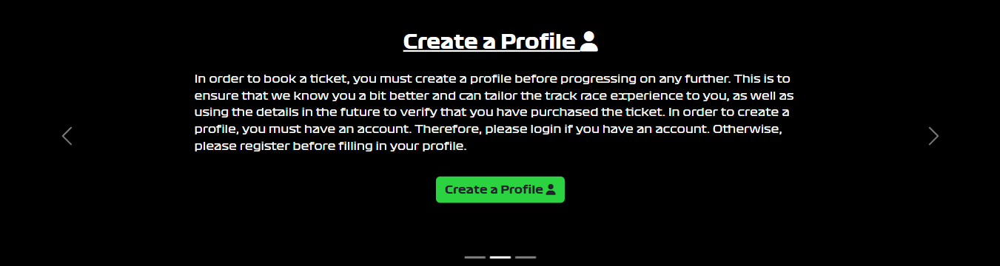

# F1 Dublin Race Ticket Booking System

## Introduction

Welcome to the coding repository dedicated to the F1 Dublin City Grand Prix website; A website which not only provides details about a made up street track located in Dublin City, Ireland, but also allows users to book tickets for the event.

The project is very relevant as Formula 1 is an increasingly popular sport, frequently looking to add new race locations and the flexibility of the website ensures that its design can be utilised for any event that requires booking a ticket in advance.

[Visit the Website Here](https://f1-dublin-race.herokuapp.com)

[Visit the Project's GitHub Repository Here](https://github.com/Grawnya/f1-dublin-race-ticket-booking-system)

# Table of Contents

* [UX](#ux "UX")
    * [Strategy](#strategy "Strategy")
    	* [Purpose](#purpose "Purpose")
   	    * [User Stories](#user-stories "User Stories")
   	        * [For This Sprint](#for-this-sprint "For This Sprint")
   	        * [For Future Sprints](#for-future-sprints "For Future Sprints")
    * [Scope](#scope "Scope")
    	* [Sprint 1](#sprint-1 "Sprint 1")
    	* [Sprint 2](#sprint-2 "Sprint 2")
    	* [Future Sprints](#future-sprints "Future Sprints")
    * [Structure](#structure "Structure")
    	* [Project Applications](#project-applications "Project Applications")
    	* [Databases](#databases "Databases")
			* [WebsiteUser](#websiteuser "WebsiteUser")
			* [Ticket](#ticket "Ticket")
    * [Surface](#surface "Surface")
    	* [Font](#font "Font")
    	* [Icons](#icons "Icons")
    	* [Colours](#colours "Colours")
    	* [Responsive Screens](#responsive-screens "Responsive Screens")
	* [Features](#features "Features")
		* [Existing Features](#existing-features "Existing Features")
			* [Landing Page](#landing-page "Landing Page")       
			* [Navigation Bar](#navigation-bar "Navigation Bar")       
			* [Information Carousel](#information-carousel "Information Carousel")       
			* [Race Details Section](#race-details-section "Race Details Section")       

\
&nbsp;

# UX
User Experience of UX focuses on how accessible the website is to the user and it’s ease of use, which is pivotal the website’s success.

Therefore, the UX aspect of the project can be broken down into 5 Planes:
* The Strategy Plane
* The Scope Plane
* The Structure Plane
* The Skeleton Plane
* The Surface Plane
\
&nbsp;

## Strategy
In order to ensure the project aligns with these planes, it is vital to keep the target audience at the forefront at all times.

The target audience consists of:
* 25 – 45 year olds.
* People that are avid sport and Formula 1 fans.
* People who like to share their experiences with their friends.

As a result, users will expect:
* A website with easy navigation and a logical progression to its flow.
* Plenty of information with regards to the F1 race and track details.
* The ability to book, edit and cancel tickets for the event.
\
&nbsp;

### Purpose
The purpose of this website is to promote a potential Formula 1 race in Dublin in the future and allow users to register their interest in the first wave of ticket releases.
\
&nbsp;

### User Stories
#### For This Sprint
| id  |  Content | Label |
| ------ | ------ | ------ |
| [1](https://github.com/Grawnya/f1-dublin-race-ticket-booking-system/issues/1) | As a user, I can navigate through the website easily so that I can get more information about the race, the track itself and ticket booking. | Must Have |
| [2](https://github.com/Grawnya/f1-dublin-race-ticket-booking-system/issues/2) | As a user, I can get information regarding the race details so that I can spend less time having to search for the suitable information. | Must Have |
| [3](https://github.com/Grawnya/f1-dublin-race-ticket-booking-system/issues/3) | As a user, I can obtain ticket booking information so that I can easily book tickets. | Must Have |
| [4](https://github.com/Grawnya/f1-dublin-race-ticket-booking-system/issues/4) | As a user, I can find the race's social media accounts so that I can keep up-to-date with race details. | Should Have |
| [5](https://github.com/Grawnya/f1-dublin-race-ticket-booking-system/issues/5) | As a user, I can see who else is attending the race so that I know what fans are in attendance. | Could Have |
| [6](https://github.com/Grawnya/f1-dublin-race-ticket-booking-system/issues/6) | As a user, I can book a ticket so that I can attend the race. | Must Have |
| [7](https://github.com/Grawnya/f1-dublin-race-ticket-booking-system/issues/7) | As a user, I can register or log in so that I can manage my tickets. | Must Have |
| [8](https://github.com/Grawnya/f1-dublin-race-ticket-booking-system/issues/8) | As a user, I can buy tickets for others so that I can bring more people to the race. | Should Have |
| [9](https://github.com/Grawnya/f1-dublin-race-ticket-booking-system/issues/9) | As a user, I can see if I am logged in so that I can easily log out or log in. | Must Have |
| [11](https://github.com/Grawnya/f1-dublin-race-ticket-booking-system/issues/11) | As a user, I can select my favourite team when booking tickets so that I can let users know who I support and see who other fans in attendance support. | Could Have |
| [12](https://github.com/Grawnya/f1-dublin-race-ticket-booking-system/issues/12) | As a user, I can select my nationality when booking tickets so that I can let users know what country I am from and see where other fans in attendance are from. | Could Have |
| [13](https://github.com/Grawnya/f1-dublin-race-ticket-booking-system/issues/13) | As a user, I can input a nickname so that I don't have to reveal my real name and can use it to identify people whom I am buying tickets for | Should Have |
| [14](https://github.com/Grawnya/f1-dublin-race-ticket-booking-system/issues/14) | As a user, I can select my seat when booking tickets from a graphic so that I can easily see what seats are free and where I can potentially sit. | Should Have |
| [15](https://github.com/Grawnya/f1-dublin-race-ticket-booking-system/issues/15) | As a user, I can easily use the navbar to navigate the website so that I can find all relevant content. | Must Have |
| [16](https://github.com/Grawnya/f1-dublin-race-ticket-booking-system/issues/16) | As a user, I can edit and/or delete tickets I have booked when logged in so that I can make any necessary changes. | Must Have |
| [18](https://github.com/Grawnya/f1-dublin-race-ticket-booking-system/issues/18) | As a user, I can edit my user details when logged in so that I can ensure that my details are up-to-date. | Must Have |
| [19](https://github.com/Grawnya/f1-dublin-race-ticket-booking-system/issues/19) | As a user, I can easily reach the home page in case I get an error so that I am not stuck on an error page and have to select the back button. | Could Have |
| [20](https://github.com/Grawnya/f1-dublin-race-ticket-booking-system/issues/20) | As a site owner/admin, I can log in so that I can access the website's backend. | Must Have |
| [21](https://github.com/Grawnya/f1-dublin-race-ticket-booking-system/issues/21) | As a site owner/admin, I can delete tickets booked by users so that I can alter the race's attendance and stand capacity. | Must Have |

\
&nbsp;
#### For Future Sprints
| id  |  Content | Label |
| ------ | ------ | ------ |
| [10](https://github.com/Grawnya/f1-dublin-race-ticket-booking-system/issues/10) | As a user, I can obtain email confirmation of my ticket bookings so that I know I have successfully booked the tickets. | Could Have |

\
&nbsp;
## Scope
In order to ensure that the current sprint (i.e. the elements required for the current project submission) are completed, the focus was as follows:
\
&nbsp;

### Sprint 1
This sprint focuses on the “Must Haves” and the marking criteria:
* A homepage with basic details on how to book tickets and obtain race details.
* Navbar enabling the user to reach the different pages within the site.
* The ability of the user to login and create a profile.
* An application that allows the user to book a ticket and then edit or delete the ticket based on their situation.
\
&nbsp;

### Sprint 2
This sprint builds on Sprint 1:
* Fills the homepage up with more details on how to book tickets and obtain race details, adding extra styling and animation of a more enjoyable experience.
* Creating a “Tickets Sold” page to allow the user to see who else is attending.
* Adding styling to card elements to create mock tickets with user’s details for their “My Tickets” page.
\
&nbsp;

### Future Sprints
Elements to add to the site in the future:
* Create an app that allows users to add tickets based on clicking on an animated SVG of a stand, similar to the cinema.
* Incorporate email confirmation.
* Allow user to put in banking details to confirm the booking.
\
&nbsp;

## Structure
Having a well-worked out project structure ensures that creating the project would occur in a more logical manner and the sprint steps can be closely followed. Therefore, the content was broken into applications to account for the various tasks and into database tables to organise how the data obtained from the user will be stored.
\
&nbsp;

### Project Applications
For this project, 3 applications were created:
* race_details – To provide details regarding booking the tickets and race information. A solely static project with no models.
* see_attendees – To create the extra “Tickets Sold” page which shows all users who opted to share their ticket info.
* booking – To book, edit and delete tickets, where the user needs to create a profile first, which is connected to the ticket booking details.
\
&nbsp;

### Databases
2 databases can be found in the “booking” application, which enable the user to create the profile required to book tickets and then to stored booked ticket information. The schematic below provides the relationship between both [the WebsiteUser Model](#websiteuser "The WebsiteUser Model") and [the Ticket Model](#ticket "The Ticket Model").

\
&nbsp;

#### WebsiteUser
The WebsiteUser model is used to obtain more information from the user than just their username, email and password. It provides relevant information with regards to the person who made the booking of a ticket and can be used to influence decisions that the race organisers will do to enhance the race experience.

It can be broken down as follows:
* `username` - Unique username that user has chosen when registering.
* `first_name` - First name of user.
* `last_name` - Last name of user.
* `email` - User's email that they didn't use to login.
* `fave_team` - User's favourite current Formula 1 team.
* `nationality` - User's nationality that they identify as.
\
&nbsp;

#### Ticket
The Ticket model is used to store ticket information, regardless of if it being a new ticket, or if it is an existing ticket that is being edited or deleted. Information from the ticket booking can be shared if the person booking the ticket opts to share the details on the “Tickets Sold” page.

It can be broken down as follows:
* `for_self` - Boolean value if ticket is for the user or a non-user.
* `booked_by` - Connection to the current user's WebsiteUser object.
* `first_name`  - First name of user.
* `last_name` - Last name of user.
* `booked_on` - DateTime of when the form was booked for easier organisation.
* `nickname` - A nickname that the user may have for the shared ticket.
* `fave_team` - User's favourite current Formula 1 team.
* `nationality` - User's nationality that they identify as.
* `seat_number` - The seat number in which the user will sit.
* `stand` - The stand letter in which the user will be sitting in.
* `show` - Boolean value if the user wants to share their attendance in the “Tickets” Sold page.
\
&nbsp;

## Skeleton
The skeleton provides a broad initial idea that is further refined and built on. It enables the creation of a plan that aligns with the requirements of the [user stories](#user-stories "User Stories") and the [sprints](#scope "Sprints"). Therefore, wireframes can be created to act as a design aid and provide the website skeleton.
\
&nbsp;

### Wirefames
[Balsamiq](https://balsamiq.com/wireframes/ "Balsamiq") was used to create the conception for the website appearance and flow. I initially created a mobile version in-line with my mobile-first approach and then followed with a medium and large screen version. The key is to make sure that the website is responsive on various screens.

Basic wireframes can be found below (Note that these vary slightly from the final website design):

* [Home Page](documentation/home_page.png "Home Page")
* [Tickets Sold](documentation/tickets_sold.png "Tickets Sold") – The My Tickets Page is very similar, as it shows only the user’s tickets with edit and delete buttons beneath and has an extra button to redirect to the user’s profile.
* [Buy Tickets](documentation/buy_tickets.png "Buy Tickets") – The pages to edit and delete the tickets are very similar.
\
&nbsp;

## Surface
The surface plane refers more to the aesthetics and the interface itself. It’s important to select the right colour, font and icons for your website to ensure it is as appealing as possible.
\
&nbsp;

### Font
The fonts used were the official Formula 1 fonts. They were sourced from [here](https://www.reddit.com/r/formula1/comments/8rpzq3/f1_font/) and were used in suitable sections.

The Formula 1 fonts that were used are and they can be seen below:
* Formula1-Black
* Formula1-Bold
* Formula1-Regular
* Formula1-Wide

The font was loaded into the project used `.tff` files and following the steps found at [this link](https://www.geeksforgeeks.org/how-to-include-a-font-ttf-using-css/).
\
&nbsp;

### Icons
In order to obtain some icons for the website, [Font Awesome](https://fontawesome.com/ "Font Awesome") will be utilised. Icons were only utilised in the carousel to add a bit of character to the main page.

For the user’s nationality, their country’s flag will be displayed on the ticket. The [`flag-icons`](https://alexsobolenko.github.io/flag-icons/) CSS library was used to create these.
\
&nbsp;

### Colours
To select the colour palette for the project, I was inspired by the official Formula 1 colour scheme, which heaving relies on a distinct shade of an orange based red, black and white. When checking the contrast of the colours on [Web AIM](https://webaim.org/resources/contrastchecker/ "Web AIM"), the dark green with the white passed. For the light mode, the dark blue with the white also passed. Therefore the following colours were selected for the project:

Where:
*  #E13726 (also known as --f1-red) is used for the background of one of the carousel slides as well as the majority of the backgrounds of the buttons on the website.
*  #fff (also known as white) is used for the majority of the websites background and the font colour of many buttons.
*  #000 (also known as --black) is used for the background of one of the carousel slides and for the majority of the font.
*  #2cd341 (also known as --green) is used for the background of one of the carousel slides and occasionally is a background colour for a button if it is next to a button in --f1-red.
*  #ebff00 (also known as --yellow) is used for the background of one of the carousel slides and often for buttons in their hover state.

Each Formula 1 team also required a set of colours based on their 2022 colour scheme and can be seen in the diagram below. These colours were used to created the ticket styling,

\
&nbsp;

### Responsive Screens
The website will be built for a small mobile screen of width 320px and then will also meet the requirements for a medium/tablet, large and extra-large screen, as shown in the table below.

| Screen Size   | Breakpoint |
| -----------   | ---------- |
| small/mobile  |    320px   |
| medium/tablet |    768px   |
| large         |   992px    |
| extra-large   |   1400+px  |

\
&nbsp;
[Back to Top](#table-of-contents)
\
&nbsp;

# Features

## Existing Features
### Landing Page
The landing page is the first introduction to the website that the user generally has and therefore, it needs to be visibly attractive and easy to navigate. The large Formula 1 Dublin City Grand Prix logo at the top of the page tells the user clearly what the website is about. 

A labelled navigation bar with various headings provides the user with details regarding how to use the website effectively.

A carousel with bright slides attracts the user to its content, which prompts the user to create a profile, show the tickets that have already been bought or to obtain more race details.

\
&nbsp;

### Navigation Bar

The navigation bar is designed to be responsive for the different screen sizes and collapses into a hamburger button if there is not enough room on the screen to fit. Each item within the navigation bar links to a section on the website. In order to increase each items readability, aria-labels are used:

The navigation bar is white in colour with black font to contrast each other easily and to increase readability. If the user is hovering over the various navigation bar items, if it is over a particular one, it will cause the font to turn red.

The hamburger button matches the red colour used for the project along with the red border at the bottom of the navigation bar which acts as a clear divider between the navigation bar and the content of the webpage.

\
&nbsp;

### Information Carousel
The information carousel is used at the top of the home page to attract users to its contents. The slides vary in colour to draw the user’s attention compared to the predominantly white sections above and below it. The design is responsive and each slides contents can be seen clearly on various devices.

The slides are broken down as follows:
* Slide 1: Promote “Tickets Sold” page – Encourages user to see who is going, which either encourages them to buy a ticket or find out more about the race.
* Slide 2: Urge the user to create a profile – It is vital for the user to create a profile in order to buy a ticket.
* Slide 3: Acquire race details – The slide teases some of the race details, drumming up excitement about the event.

\
&nbsp;

### Race Details Section
In order to promote the race, details regarding the track and the event need to be provided. 3 eye catching details regarding when the event will take place and track characteristics – length and turns, provide a quick snapshot.

A schematic of the track along with 4 stands is shown. Within the paragraphs, the user is prompted to click on this schematic in order to turn it into an image of the track mapped out onto its real life route on Google Images. Some of the tourist attractions nearby are also briefly mentioned in this section.

On smaller screens, all the element stack up on top of each other so the content is still easy to follow.

\
&nbsp;
